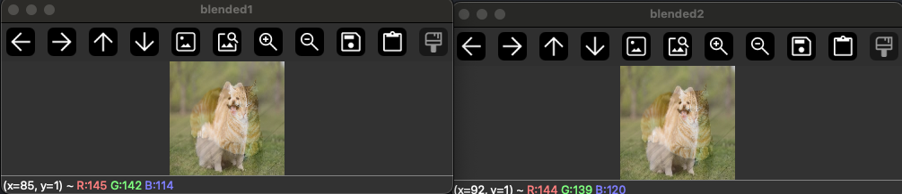

### 이미지를 합성하는 경우 대부분의 픽셀값들이 더해지면서 자연스럽게 255 값을 넘게 됩니다.

### 그래서 단순히 + 연산을 사용하여 더한 이미지의 경우 갑자기 이상한 색깔이 나오는 현상을 확인할 수 있습니다.

### 그리고 cv2.add()를 사용한 경우 255를 넘는 모든 픽셀에 대해서 255값을 할당하기에 대부분의 픽셀이 거의 하얀색인것을 확인할 수 있습니다.

  
# 추가 포인트

dtype = np.uint8 로 설정하는 경우에는 새로운 배열을 만드는 경우 주로 사용을 하고 
.astype(np.uint8) 로 설정하는 경우에는 이미 생성된 배열의 타입을 바꾸기 위해서 사용합니다. 

그리고 이미지를 다루는 경우 보통 uint8을 사용해서 0 ~ 255를 표현하지만 고화질 이미지 혹은 이미지를 정규화 하는 경우에는 float32 같은 숫자를 사용하기도합니다.
  

### 그래서 두 이미지를 더할때 단순히 더하기 보다는 각 이미지의 픽셀에 특정 가중치를 곱해서 더해주게 됩니다. 그리고 이떄 곱해지는 상수를 알파값이라고 부르게 됩니다. 그리고 이렇게 가중치를 주고 섞는 방법을 알파블랜딩 이라고 합니다.