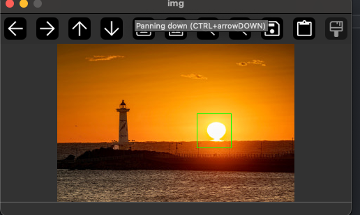

# ROI ( Region of Interest )

Numpy의 경우 슬라이딩을 하게 되면 새로운 메모리에 해당 정보를 저장하는게 아니라 메모리 주소를 복사하기 떄문에 ROI.py에서 처럼 roi를 분리하고 roi 이미지에 대해서 사각형을 그리는 경우에도 실제 이미지의 해당 roi 위치에 사각형이 그려지는 것을 확인할 수 있습니다.

만일 완전히 새로운 roi 영역을 지정하고 싶은 경우 roi = roi.copy() 이런 식으로 설정해줘야합니다.

